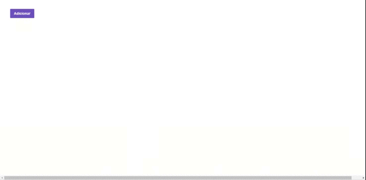

<p align="center">
    


<a href="https://www.linkedin.com/in/alquiponeto/">
    
</a>

<a href="https://github.com/Alquipo/GoStack12-desafio-03/commits/master">
    
</a>


</p>

<p align="center">

<a href="https://nodejs.org/en/">
  
</a>

<a href="https://reactjs.org/">
  
</a>

</p>
<h2 align="center">
  Desafio 03: Conceitos do React JS
</h2>

## 🚀 Sobre o desafio

Terceiro desafio foi desenvolver uma página web onde mostra os dados de repositório da `API` desenvolvida no [Desafio anterior][desafio2] os dados ficam salvos em um Array, enquanto o servidor está sendo executado. Foi criado na página web onde lista os repositórios, efetua adição aleatório de repositório e deletar o repositório.

## 🎉 Melhorias

    - Convertido todo o Projeto para TypeScript
    - Refeito a interface do projeto para ficar acessível;
    - Adicionado a visualização da url, techs e curtidas;
    - Adicionado um botão para curtir o Repositório;

## 🎨 Layout

### Original

<h4 align="center">
  
</h4>

### Versão Final

<h4 align="center">
  
</h4>

## 🔨 Tecnologias:

- [TypeScript][typescript]
- [ReactJS][reactjs]
- [Axios][axios]
- [Babel][babel]
- [Webpack][webpack]

## 🚀 Como rodar este projeto

Para clonar e executar este aplicativo, você precisará de [Git](https://git-scm.com), [NodeJs][nodejs] Instalado em seu computador.

O projeto e divido em duas partes:

1. Back End ([Link do Rpositório][desafio2])
2. Front End

💡 E preciso efetuar o clone e seguir os passos de instalação do [Repositório da API][desafio2]

💡 O Front End precisa que o Back End esteja sendo executado para funcionar.

### 🌀 Clonando o repositório

```bash
# Clone este repositório
$ git clone https://github.com/Alquipo/GoStack12-desafio-03

# Acesse a pasta do projeto no terminal/cmd
$ cd GoStack12-desafio-03
```

### 🧭 Rodando a aplicação web

```bash
# Instale as dependências
$ yarn

# Execute a Aplicação
$ yarn start

# Execute o teste da Aplicação
$ yarn test

# O servidor inciará na porta:3000 - acesse http://localhost:3000
```

## 🤔 Como contribuir para o projeto

- Faça um **fork** do projeto;
- Crie uma nova branch com as suas alterações: `git checkout -b my-feature`
- Salve as alterações e crie uma mensagem de commit contando o que você fez:`git commit -m "feature: My new feature"`
- Envie as suas alterações: `git push origin my-feature`

> Caso tenha alguma dúvida confira este [guia de como contribuir no GitHub](https://github.com/firstcontributions/first-contributions)

## 📝 Licença

Este projeto esta sobe a licença MIT. Veja a [LICENÇA][license] para saber mais.

Feito com ❤️ por Alquipo Neto 👋🏽 [Entre em contato!](https://www.linkedin.com/in/alquiponeto/)

[reactjs]: https://reactjs.org/
[axios]: https://www.npmjs.com/package/axios
[babel]: https://babeljs.io/
[webpack]: https://webpack.js.org/
[rs]: https://rocketseat.com.br
[license]: https://opensource.org/licenses/MIT
[desafio2]: https://github.com/Alquipo/GoStack12-desafio-02
[typescript]: https://www.typescriptlang.org/
